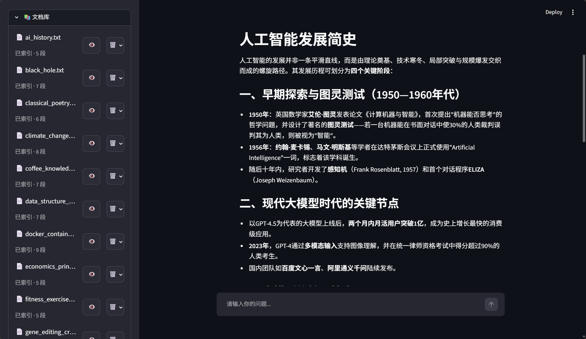
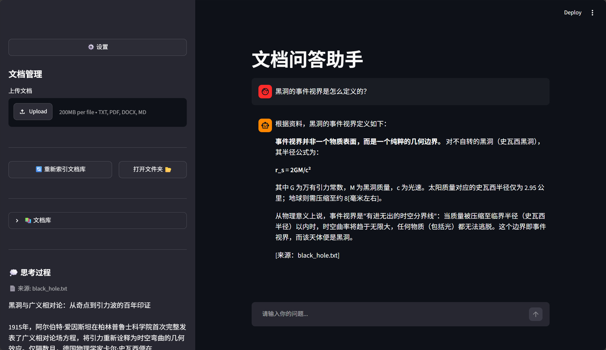

# QA Agent — 你的私人知识库问答助手

[](https://github.com/QHzzy035/QA_agent/actions/workflows/ci.yml)


把你收藏的文章、笔记、文档，变成一个可以**直接对话的知识库**。上传文档 → 自动检索 → 用自然语言提问，AI 结合你的资料回答，查不到还能联网搜索；一句话即可切换文档精读总结、报告生成模式。


*文档库管理：查看已索引文档、浏览原文、删除*


*多轮对话：检索来源透明可见，可连续追问*

## 工程要点

不只是把模型接起来跑通。几处专门做了工程处理：

**依赖瘦身：1.8 GB → 616 MB。** 项目原本通过 `unstructured` 引入了
torch / transformers / spacy，而代码实际只用到它的文件加载器。追溯依赖树
确认这些包从未被调用后，改用 `pypdf` + `python-docx` 直接实现——
索引模块的导入耗时从 8.1 秒降到 0.45 秒，安装体积从 208 个包降到 140 个。

**133 个单元测试 + GitHub Actions CI。** 除 3 个界面冒烟测试外，全部
**不依赖 API Key、网络与真实向量库**（模型 / 向量库 / 文档加载器均以假对象
替换），CI 上直接运行。这些测试不是凑覆盖率的摆设——开发过程中它们抓出了
4 个真实 Bug，其中一个（Windows 换行符未归一化导致文本切分的段落边界被
静默忽略）不报错、不崩溃，只是让检索质量悄悄变差。

**44 条标注的检索评测集。** 用 Recall@K / MRR / MAP 量化检索质量，
让调参有依据而不是凭感觉改 `k` 和 `chunk_size`。标注刻意**不照抄文档原句**——
字面完全重合的话，连最笨的检索器都能命中，指标会虚高。见 [`eval/`](eval/)。

**纯标准库手写的 PDF 生成器。** TrueType 字体内嵌、cmap 子表解析、ToUnicode
CMap、xref 交叉引用表全部自己实现，不引入 reportlab 等依赖。支持 `.ttf` 与
`.ttc` 字体集合，生成的文件用 pypdf 能正确抽回中文。见
[`tools/pdf_writer.py`](tools/pdf_writer.py)。

**模块导入无副作用。** 模型与向量库改为惰性创建，任何模块都能在没有 API Key
的环境下导入——这是让上面那 133 个测试得以存在的前提。CI 里有一步专门断言
这件事，防止以后有人把模块级副作用加回来。

## 功能

- 📄 **多格式文档支持**：txt / pdf / docx / md
- 🎭 **三模式问答**：普通问答 / 文档精读总结 / 报告生成，智能体根据用户需求自动切换
- 🔍 **MMR 多样化检索**：兼顾相关性和多样性
- ⚡ **增量索引**：基于 MD5 只索引新增/变更文档，避免全量重建、节省 embedding 费用
- 🌐 **智能联网搜索**：文档库查不到时自动联网搜索
- 💬 **多轮对话**：上下文理解 + 指代消解（查询改写）+ 来源记忆，历史过长自动摘要压缩
- 🧠 **思考过程可视化**：侧边栏展示检索来源和工具调用
- 📤 **文件上传**：Streamlit 界面内直接上传文档
- 🗂️ **文档管理**：文档库列表、索引状态查看、原文浏览、删除、折叠
- 📂 **一键打开文档目录**：侧边栏点一下即可在系统文件管理器中定位到文档文件夹
  （由运行 Streamlit 的机器执行；云端部署无图形界面时会转为显示完整路径）
- ⚙️ **可配置**：右上角设置面板，检索条数 / 历史压缩阈值随时调（仅本次会话生效）
- 📋 **结构化日志**：控制台 + 文件双输出，按天分割，便于排查

## 快速开始

### 1. 克隆项目

```bash
git clone https://github.com/QHzzy035/QA_agent.git
cd QA_agent
```

### 2. 安装依赖

项目使用 [uv](https://github.com/astral-sh/uv) 管理依赖，需要 Python >= 3.11。先安装 uv，然后在项目目录执行：

```bash
uv sync
```

### 3. 配置 API Key

复制 `.env.example` 为 `.env`，然后填入你自己的 Key：

```bash
# Windows（PowerShell）
Copy-Item .env.example .env
# macOS / Linux
cp .env.example .env
```

编辑 `.env`，填入三个 Key：

```env
DASHSCOPE_API_KEY=你的阿里云APIKey
TAVILY_API_KEY=你的TavilyAPIKey
DEEPSEEK_API_KEY=你的DeepSeekAPIKey
```

> ⚠️ **提醒**：`.env` 已被 `.gitignore` 排除，**不会提交到仓库**，请保管好自己的 Key 不要外泄。如果你已经把 Key 配在系统环境变量里了，也可以跳过这步（两种方式效果相同）。

### 4. 放入文档

**这一步可以跳过**：仓库自带的 `demo_data/` 里有 6 篇演示文档，
启动时会自动建立索引，可以直接开始提问。

想用自己的文档，二选一：

- **自己放文档**：把要检索的文档（txt / pdf / docx / md）放进 `test_data/`
  （该目录被 `.gitignore` 排除，首次运行会自动创建）。放了之后
  `test_data` 就会取代 `demo_data` 成为文档目录。
- **生成测试文档**：项目自带脚本，按格式分别生成中文测试文档（txt 30 篇，md / docx / pdf 各 10 篇）：

  ```bash
  python -m tools.generate_txt    # 生成 30 篇 .txt
  python -m tools.generate_md     # 生成 10 篇 .md
  python -m tools.generate_docx   # 生成 10 篇 .docx
  python -m tools.generate_pdf    # 生成 10 篇 .pdf
  ```

  > 生成会调用 DeepSeek API 产生费用，建议安排在空闲时段运行。

### 5. 启动

```bash
streamlit run streamlit_file.py
```

### 6. 使用

- **普通问答**：直接提问，AI 结合知识库文档回答；
- **文档精读总结**：说「总结 / 精读 / 概括」某篇文档，自动切换到总结模式；
- **报告生成**：说「生成报告 / 写一份报告」，自动切换到报告模式；
- **增量索引**：上传或修改文档后，点侧边栏「🔄 重新索引文档库」，只处理新增/变更的文档。

## 项目结构

```
QA Agent/
├── agent.py                     # 智能体定义
├── middleware.py                # 智能体中间件（工具监控/日志/动态提示词）
├── streamlit_file.py            # Web 界面
├── pyproject.toml               # 项目依赖配置（uv 管理）
├── uv.lock                      # 依赖锁文件
├── requirements.txt             # 由 uv.lock 导出，供 Streamlit Cloud 部署使用
├── .python-version              # Python 版本要求
├── .github/
│   └── workflows/ci.yml         # CI：跑测试 + 校验模块可在无 Key 环境导入
├── tests/                       # 单元测试（不依赖 API Key / 网络 / 真实向量库）
│   ├── conftest.py              #   公共假对象（向量库 / 切分器 / 文档加载）
│   ├── test_indexer.py          #   增量索引判定与容错
│   ├── test_document_service.py #   多格式抽取、编码自适应、CRLF
│   ├── test_query_rules.py      #   检索前置规则
│   ├── test_factory.py          #   模型工厂选型与缓存
│   ├── test_pdf_writer.py       #   PDF 生成器结构有效性
│   ├── test_prompts.py          #   提示词与模式映射
│   ├── test_eval_metrics.py     #   检索指标计算
│   └── test_app_smoke.py        #   界面冒烟（需 API Key，无则跳过）
├── eval/                        # 检索质量评测
│   ├── README.md                #   度量口径、成本说明、局限
│   ├── golden_set.json          #   44 条标注查询，覆盖全部语料主题
│   ├── metrics.py               #   Recall@K / MRR / MAP（纯函数）
│   └── run_eval.py              #   评测入口（支持 --validate-only 零成本校验）
├── assets/
│   ├── doc_manage_demo.png      # 文档库管理截图
│   └── dialog_demo.png          # 知识库对话截图
├── .streamlit/
│   ├── config.toml              # Streamlit 配置
│   └── secrets.toml.example     # 云端部署的密钥模板（真正的 secrets.toml 已被 gitignore）
├── config/                      # 配置目录（YAML 格式）
│   ├── LLM.yaml                 #   大模型配置
│   ├── rag.yaml                 #   RAG 检索配置
│   └── tavily.yaml              #   联网搜索配置
├── model/
│   └── factory.py               # 模型工厂（聊天/总结/改写/嵌入统一创建，惰性实例化）
├── tools/
│   ├── config_loader.py         # 配置加载工具
│   ├── logger_handler.py        # 结构化日志
│   ├── document_service.py      # 文档抽取/列表/删除（索引与界面预览共用同一实现）
│   ├── pdf_writer.py            # 纯标准库 PDF 生成（中文字体内嵌）
│   ├── generate_txt.py          # 测试数据生成脚本（txt）
│   ├── generate_md.py           # 测试数据生成脚本（md）
│   ├── generate_docx.py         # 测试数据生成脚本（docx）
│   └── generate_pdf.py          # 测试数据生成脚本（pdf）
├── prompts/
│   ├── system_prompts.txt       # 系统提示词（普通问答模式）
│   ├── summary_prompt.txt       # 系统提示词（精读总结模式）
│   └── report_prompt.txt        # 系统提示词（报告生成模式）
├── rag/
│   ├── indexer.py               # 增量索引
│   ├── splitter.py              # 文档切割
│   ├── retriever.py             # 向量检索
│   └── connected_prompts.py     # 提示词拼接
├── demo_data/                   # 演示语料（随仓库提供，保证 clone 下来就能用）
└── test_data/                   # 本地文档存放目录（被 gitignore，运行时自动创建）
```

> **文档目录的选取规则**：优先用 `test_data`；它不存在或为空时（新克隆的仓库、
> 云端部署都属于这种情况）自动回退到 `demo_data`，保证开箱就有内容可问。
> 两者都存在时以 `test_data` 为准，本地测试语料不会被演示文件干扰。

## 开发

```bash
uv sync              # 安装依赖（含开发依赖）
uv run pytest        # 运行测试（无需 API Key 也可运行）
```

测试覆盖增量索引判定、多格式文档抽取、模型工厂与提示词一致性等，
不依赖 API Key、网络与真实向量库，可直接在 CI 中运行。

检索质量评测见 [`eval/README.md`](eval/README.md)：

```bash
python -m eval.run_eval --validate-only   # 零成本校验标注
python -m eval.run_eval --k 1 3 5         # 正式评测（会调用嵌入 API）
```

## 部署到 Streamlit Community Cloud

1. 把仓库推到 GitHub（已完成）

2. 到 <https://share.streamlit.io> 新建应用，选择本仓库，
   主文件路径填 `streamlit_file.py`

3. 在应用的 **Settings → Secrets** 里按 `.streamlit/secrets.toml.example`
   的格式填入三个 Key，保存后应用会自动重启

4. 依赖由仓库根目录的 `requirements.txt` 提供（从 `uv.lock` 导出，版本全锁定）。
   `test_data/` 被 gitignore，云端不存在，应用会自动使用 `demo_data/` 里的演示语料

> **⚠️ 公开部署前请注意**：应用会用**你自己**的 API Key 处理**任何人**的提问。
> 侧边栏的上传与「重新索引」对访客开放，意味着任何人都能上传大量文档、
> 触发嵌入调用，消耗你的额度。正式公开前建议至少做其一：
> 关闭上传入口、给应用加访问密码（Streamlit 支持在 Secrets 里配
> `password` 字段并用 `st.secrets` 校验），或设置用量告警。
