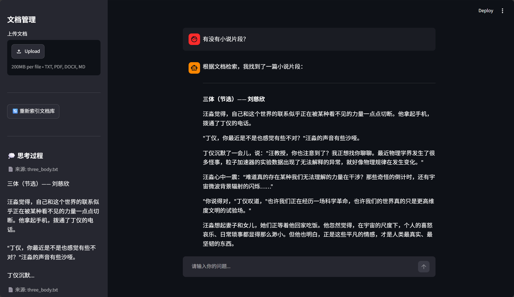

# QA Agent — 你的私人知识库问答助手

把你收藏的文章、笔记、文档，变成一个可以**直接对话的知识库**。上传文档 → 自动检索 → 用自然语言提问，AI 结合你的资料回答，查不到还能联网搜索。



## 功能

- 📄 **多格式文档支持**：txt / pdf / docx / md
- 🔍 **MMR 多样化检索**：兼顾相关性和多样性
- 🌐 **智能联网搜索**：文档库查不到时自动联网搜索
- 💬 **多轮对话**：上下文理解 + 指代消解（查询改写）+ 来源记忆，历史过长自动摘要压缩
- 🧠 **思考过程可视化**：侧边栏展示检索来源和工具调用
- 📤 **文件上传**：Streamlit 界面内直接上传文档

## 快速开始

### 1. 克隆项目

```bash
git clone https://github.com/QHzzy035/QA_agent.git
cd QA_agent
```

### 2. 安装依赖

项目使用 [uv](https://github.com/astral-sh/uv) 管理依赖，需要 Python >= 3.11。先安装 uv，然后在项目目录执行：

```bash
uv sync
```

### 3. 配置 API Key

复制 `.env.example` 为 `.env`，然后填入你自己的 Key：

```bash
# Windows（PowerShell）
Copy-Item .env.example .env
# macOS / Linux
cp .env.example .env
```

编辑 `.env`，填入三个 Key：

```env
DASHSCOPE_API_KEY=你的阿里云APIKey
TAVILY_API_KEY=你的TavilyAPIKey
DEEPSEEK_API_KEY=你的DeepSeekAPIKey
```

> ⚠️ **提醒**：`.env` 已被 `.gitignore` 排除，**不会提交到仓库**，请保管好自己的 Key 不要外泄。如果你已经把 Key 配在系统环境变量里了，也可以跳过这步（两种方式效果相同）。

### 4. 放入文档

`test_data/` 目录已被 `.gitignore` 排除，**克隆下来的项目默认是空的**。你可以二选一：

- **自己放文档**：把要检索的文档（txt / pdf / docx / md）放进 `test_data/`；
- **生成测试文档**：项目自带脚本，一键生成 30 篇中文测试文档（技术/科学/人文/生活四大类）：

  ```bash
  python -m tools.generate_test_data
  ```

### 5. 启动

```bash
streamlit run streamlit_file.py
```

## 项目结构

```
QA Agent/
├── agent.py                 # 智能体定义
├── streamlit_file.py        # Web 界面
├── pyproject.toml           # 项目依赖配置（uv 管理）
├── uv.lock                  # 依赖锁文件
├── .python-version          # Python 版本要求
├── assets/
│   └── showit.png           # README 截图
├── .streamlit/
│   └── config.toml          # Streamlit 配置
├── config/                  # 配置目录（YAML 格式）
│   ├── LLM.yaml             #   大模型配置
│   ├── rag.yaml             #   RAG 检索配置
│   └── tavily.yaml          #   联网搜索配置
├── tools/
│   ├── config_loader.py     # 配置加载工具
│   └── generate_test_data.py # 测试数据生成脚本
├── prompts/
│   └── system_prompts.txt   # 系统提示词
├── rag/
│   ├── loader.py            # 文档加载
│   ├── splitter.py          # 文档切割
│   ├── retriever.py         # 向量检索
│   └── connected_prompts.py # 提示词拼接
└── test_data/               # 文档存放目录
```
